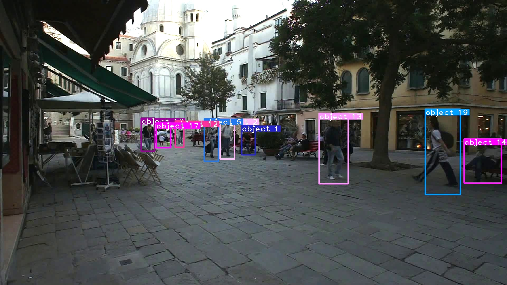

# Deep Sort with PyTorch

## Introduction
This is an implement of MOT tracking algorithm deep sort. Deep sort is basicly the same with sort but added a CNN model to extract features in image of human part bounded by a detector. This CNN model is indeed a RE-ID model and the detector used in [PAPER](https://arxiv.org/abs/1703.07402) is FasterRCNN , and the original source code is [HERE](https://github.com/nwojke/deep_sort).  
However in original code, the CNN model is implemented with tensorflow, which I'm not familier with. SO I re-implemented the CNN feature extraction model with PyTorch, and changed the CNN model a little bit. Also, I use **YOLO3** to generate bboxes instead of FasterRCNN.

## Dependencies
- python 3 (python2 not sure)
- numpy
- cv2
- sklearn
- pytorch 0.4.0

## Quick Start
0. Check all dependencies installed

1. Clone this repository
```
git clone git@github.com:ZQPei/deep_sort_pytorch.git
```
2. Download YOLO3 parameters
```
cd YOLO3/
wget https://pjreddie.com/media/files/yolov3.weights
cd ..
```
3. Download deepsort parameters ckpt.t7
```
cd deep/checkpoint
# download ckpt.t7 from 
https://drive.google.com/drive/folders/1xhG0kRH1EX5B9_Iz8gQJb7UNnn_riXi6 to this folder
cd ../../
```  
4. Run demo
```
python demo_yolo3_deepsort.py [YOUR_VIDEO_PATH]
```

## Training the RE-ID model
The original model used in paper is in original_model.py, and its parameter here [original_ckpt.t7](https://drive.google.com/drive/folders/1xhG0kRH1EX5B9_Iz8gQJb7UNnn_riXi6).  

To train the model, first you need download [Market1501](http://www.liangzheng.org/Project/project_reid.html) dataset or [Mars](http://www.liangzheng.com.cn/Project/project_mars.html) dataset.  

Then you can try [train.py](deep/train.py) to train your own parameter and evaluate it using [test.py](deep/test.py) and [evaluate.py](deep/evalute.py).


## Demo videos and images
[demo.avi](https://drive.google.com/drive/folders/1xhG0kRH1EX5B9_Iz8gQJb7UNnn_riXi6)
[demo2.avi](https://drive.google.com/drive/folders/1xhG0kRH1EX5B9_Iz8gQJb7UNnn_riXi6)




All files can also be accessed by BaiduDisk!  
linker：https://pan.baidu.com/s/1TEFdef9tkJVT0Vf0DUZvrg  
passwd：1eqo


## References
- paper: [Simple Online and Realtime Tracking with a Deep Association Metric](https://arxiv.org/abs/1703.07402)

- code: [nwojke/deep_sort](https://github.com/nwojke/deep_sort)

- paper: [YOLOv3](https://pjreddie.com/media/files/papers/YOLOv3.pdf)

- code: [Joseph Redmon/yolov3](https://pjreddie.com/darknet/yolo/)


